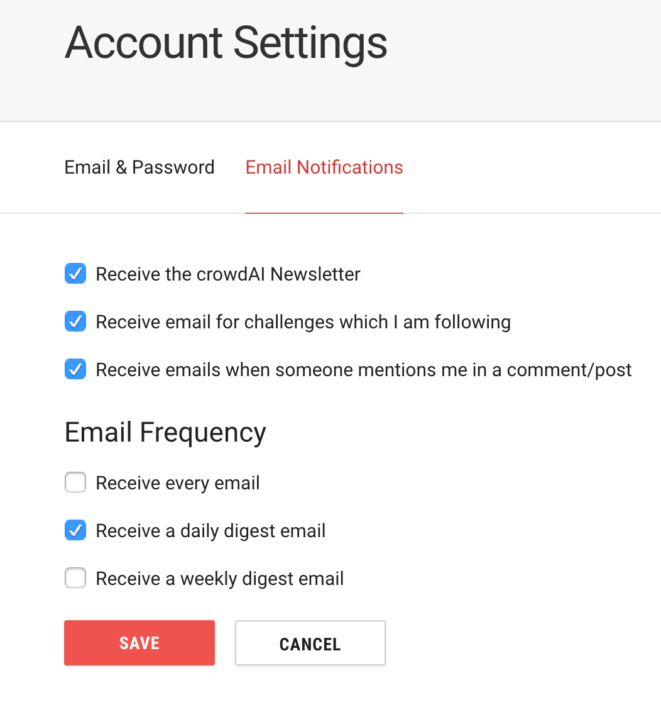

### Email Notifications

Email Notifications settings are controlled from the participant's account settings page. These settings control which emails are sent to the participant, and the frequency.

{:width="350px"}

The following emails are controlled by this page

| Email | Classname | Admin only? |
| ----- | --------- | ----------- |
| Organizer Application Notification | Admin::OrganizerApplicationNotificationMailer | Yes |
| Submission Notification | Admin::SubmissionNotificationMailer | Yes |
| Comment Notification | CommentNotificationMailer | No |
| Devise Mailers | DeviseMandrillMailer | No |
| Email Digest | EmailDigestMailer | No |
| Leaderboard Notification | LeaderboardNotificationMailer | No |
| Organizer Application |  OrganizerApplicationNotificationMailer | No |
| Submission Graded Notification | SubmissionGradedNotificationMailer | No |

### Devise emails

The standard Devise emails are always sent and not affected by these settings. These are:

- Reset password
- Resend confirmation
- Unlock account

### Mandrill Templates

All crowdAI emails use a single Mandrill template. The content is assembled within crowdAI using erb templates and inline html generated by Ruby code. This html is then sent to Mandrill via the API and put into to email body.

Other merge tags sent include:

- Recipient name
- Recipient email address
- Unsubscribe link (token)

### Email subscription controls

At the bottom of each email sent from Mandrill, there is a link to manage email preferences. This link is embedded with a token that allows the user to manage the preferences without logging into crowdAI.

### crowdAI Newsletter

The Mailchimp list **CrowdAI Participants** is maintained with all crowdAI newsletter subscribers. When a new account is created the email address is sent to Mailchimp via an API call and the list maintained there.

An unsubscribe link is present on the email, and if this is clicked the person is marked as unsubscribed on the Mailchimp mailing list. A webhook call is made to update this setting within the participant's profile, and likewise the participant can opt back in or out of the Mailchimp list from the Email Notifications page.

### Receive email for challenges which I am following

A user is defined as following a challenge if:

- They have downloaded the dataset
- They have made a submission (usually requires downloading the dataset)
- The challenge has been hearted

### Receive emails when someone mentions me in a comment/post

A participant is considered to be mentioned if they have created the topic or made any comment within a topic.

A participant will be able to directly mention another participant when this feature is implemented: https://github.com/crowdAI/crowdai/issues/270

### Email Frequency Settings

There are three exclusive settings for frequency. The actual email sent is different depending if the participant is receiving every email or a daily / weekly summary.

#### Technical Implementation

The scheduling of jobs is controlled with **sidekiq-cron** gem, and the schedule is configured in **config/schedule.yml**. Once loaded the schedule is visible from the Sidekiq monitor in it's own tab.

#### Receive every email

The participant will receive a comment notification email or a submission graded email (admins only).

#### Receive a daily digest email

The participant will receive a digest of comment notification email or a submission graded emails (admins only), sent each day at 2:30am UTC.

#### Receive a weekly digest email

The participant will receive the same digest of emails as for the daily digest, sent each Sunday at 2:30am UTC.
