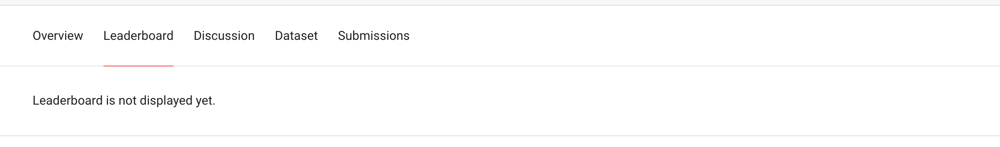
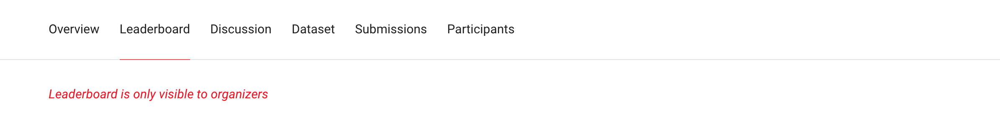

## Leaderboard and Submission Visibility

There are three interrelated pages for submissions, scores and leaderboards. Access to this data is controlled by ApplicationPolicy objects and challenge configurations.

### Leaderboard

The default setting for the leaderboard is that all users, including public users, can see the leaderboard for a challenge (**Show leaderboard?** setting is on). This includes the scores, leaderboard position, number of submissions and carries a link to the submission detail page for the top score.

The number of submissions on the leaderboard can also be clicked (everyone) to open an accordion of submissions which the participant has made.

The grader knows that score, score_secondary, message will be viewable by everyone, and hence will ensure no sensitive information is added there. The `meta` param might have sensitive information though.

If the **Show leaderboard?** setting is off, the leaderboard is viewable only by admins and challenge organizers. The Leaderboard tab will remain, and for other users, a message will appear.

When the leaderboard is not generally visible, a message reminds the organizer that only they can see it.

### Submissions

When **Show leaderboard?** setting is on :   
Every participant (signed in or otherwise) can see all the details about the submission (score, score secondary, grading_status, message, associated media).

In case of GitLab grader-based submissions, private information related to the submission, if any, will added to the corresponding issue (on gitlab) for every submission to which only the participant will have access.  

When **Show leaderboard?** setting is off:  

- Admins and organisers can view full submission details.

- Participants can see *only* their `grading_status`, and `grading_message`.

Participants will get feedback if their submission was successful or not; but not any feedback about their scores.

#### Private Challenges

For private challenges, when the **Show Leaderboard?** setting is off:

- Admins and organisers can view full submission details.

- Participants can see their own submission information, including scores.

### Submissions Detail

This page is usually a public, sharable view of details about the submission, including visualizations, logfiles, grading status and scores.

The visibility for this page is controlled via the **Submissions Details Visible?** configuration setting. If set to OFF, the page is completely inaccessible, even to admins.

When **Submissions Details Visible?** is on, and challenge **Show leaderboard?** is off, then *only* admins and organisers should have access to the detail page. The participant themself will not be able to see it.
