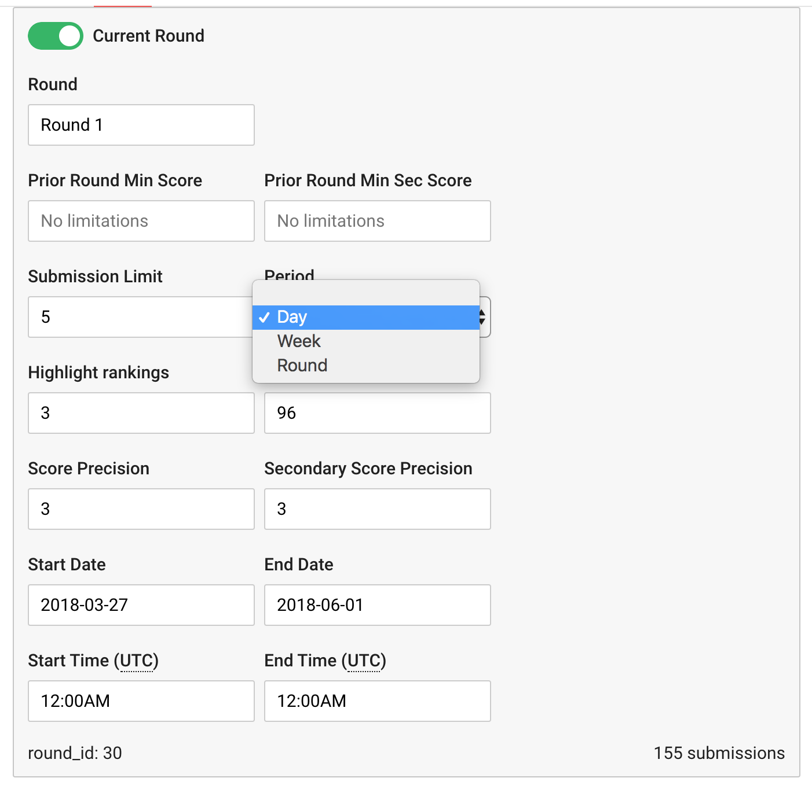

## Submission Limits

Challenge Rounds are configured with submission limits of either:

- Day
- Week
- Round

When a submission is made, crowdAI determines if the participant is still eligible to make submissions in this round, based on the Submission Limit settings.

### Errored Submissions

Both successful and errored submissions are counted towards submission limits. The submission status is recorded by the **submissions.grading_status_cd** field.

### Round

For Challenge Rounds with a Submission Limit Period of **round**, a simple count of previous submissions made during this round is compared against the Submission Limit setting configured on the Challenge.

### Day

When the Submission Limit Period is set to **day**, the Submission Limit setting refers to the number of submissions possible in a 24 hour window.

When a new submission is made, crowdAI looks back 24 hours, and counts how many submissions were made in this period.

### Week

Submission Limit Periods of **week** work the same way as **day**, except that the window is 7 days (7 x 24 hours).

#### Reset Time

The Reset Time is returned by crowdAI when the submission is attempted. This is the time of the first submission in the Submission Window + 24 hours.

### Submissions Query

Internally, the submission limits are determined by the SubmissionsRemainingQuery. This query accepts a Challenge instance and a participant_id.

It then returns the following information:

- The number of remaining submissions in this 24 hour period
- The reset time, for Day and Week Submission Limit Periods.
- An array of previous submissions made during this period (submission_id, grading_status_cd, submission_dttm)
