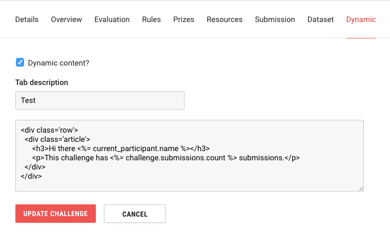

## Dynamic Challenge Content 

crowdAI supports a Dynamic Content page which can be used to inject challenge-specific ERB code, including JavaScript enclosed in ```<script></script>``` tags. The content is added to a new tab in the challenge view, the title of which is also configurable.


The code has access to the following instance variables:

- challenge
- current_participant

As these are regular Rails instance variables, they can be chained using dot notation to make queries for subordinate objects.

## Example




## Security

Dynamic Content is available only to crowdAI admins.
